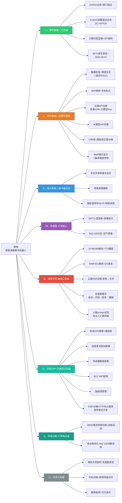

# 啾啾项目 · 全任务分解树状图（WBS）

## 优先级与关键路径

1. **现在可做**：B分支（软件基础）——触摸调试收尾、WiFi、API注册、大模型对接
2. **读卡器到了**：C分支（显示系统）——中文字体是所有UI的根基
3. **语音模块接入**：E分支（核心灵魂）——先TTS会说话，再录音，再全链路
4. **APP并行开发**：F分支——KIMI Work按 `docs/手机APP开发交接.md` 开工，硬件端配合实现HTTP/BLE服务
5. D、G、H收尾补强

> 优先级排序：中文显示 > 语音对话 > 触摸交互 > APP联动 > 传感器 > 电池/外壳